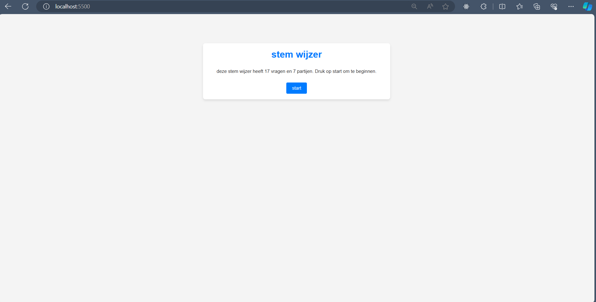

# Burgerschap stemwijzer odpracht

Dit project is een opdracht gemaakt voor het vak Burgerschap voor de periode "Politiek Juridisch".
De opdracht is een stemwijzer gemaakt voor de verkiezingen van 2023 in Nederland.

## Over deze opdracht

Tijdens de periode Politiek Juridisch focussen wij ons voornamelijk op de politiek niet alleen binnen Nederland, maar ook daarbuiten. Om de periode
met een voldoende te kunnen afronden moet er een eindopdracht ingeleverd worden.
Verder behandelen we ook zaken die nu spelen rondom de wereld, zoals de oorlog in Oekraïne en in Syrië.

## De opdracht/ Instructies

Zorg dat voordat je het project cloned je gebruik maakt van een code editor en een extensie heb voor live server hosting.

Clone de repository met de volgende command:

```bash
git clone https://github.com/Xander172006/stemwijzer.git
```

Hierna hoef je alleen nog naar de index.html bestand te gaan en deze openen met live server
<br />

### hoe werkt het?

<div class="image-container">
  

  
</div>

<br />

Je ziet als eerst een startscherm waarop staat dat je 17 vragen zal gaan beantwoorden over de politiek en het kabinet.
Klik op de "start" knop en vul de vragenlijst in 


Uiteindelijk, zodra alle vragen zijn ingevuld zul je het resultaat zien van welke parij het meest gunstig is voor jouw beslissingen.

Voor verdere vragen kun je bij mij langs komen of een bericht achterlaten.

## Contributie


[](Xander172006)

**Location:** Bit Academy, Amsterdam
</br>
**Email:** xanderpoggenklaas@gmail.com
</br>
**Twitter:** [@XPoggenklaas](https://twitter.com/XPoggenklaas)

<style>
  .image-container {
    display: flex;
    justify-content: space-around; /* Adjust this as needed */
  }
  .image-container img {
    width: 48.5%; /* Adjust the width percentage as needed */
    max-width: 500px; /* Optional: to set a maximum width */
    height: auto; /* Maintain aspect ratio */
  }
</style>
